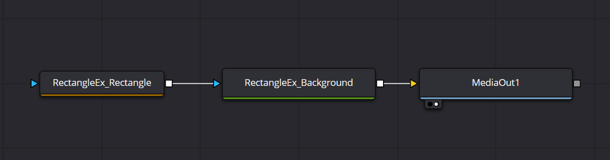

# RectangleEx

角を持って動かせる四角形


## Flow

RectangleExの構成は以下の通り  
※ `Rectangle1`, `Transform1`は[スクリプト内](#execute-script)で参照しているため名前変更不可




## Area Control

左上、右下をそれぞれ`Left Top`, `Right Bottom`として[Rectangle1](#flow)へコントロールを追加し  
それを使用して四角形の位置・サイズ調整を行う

### Left Top

| 設定先 | 値 |
| ---- | ---- |
| Name | `Left Top` |
| ID | `LeftTop` |
| Type | `Point` |
| Page | `Controls` |
| Default | `0.25` : `0.75` |
| Input Ctrol | `OffsetControl` |
| View Ctrl | `CrosshairControl` |
| DispScale | 空欄 |
| Style | `NormalCross` |

### Right Bottom

| 設定先 | 値 |
| ---- | ---- |
| Name | `Right Bottom` |
| ID | `RightBottom` |
| Type | `Point` |
| Page | `Controls` |
| Default | `0.75` : `0.25` |
| Input Ctrol | `OffsetControl` |
| View Ctrl | `CrosshairControl` |
| DispScale | 空欄 |
| Style | `NormalCross` |


## Calculated Parameters

[Rectangle1](#flow)の下記パラメータはExpressionとし、  
`Left Top`, `Right Bottom`から計算で求める

## Width

```lua
abs(RightBottom.X - LeftTop.X)
```

## Height

```lua
abs(LeftTop.Y - RightBottom.Y)
```

## Center

```lua
Point(LeftTop.X + ((RightBottom.X - LeftTop.X))/2, RightBottom.Y + ((LeftTop.Y - RightBottom.Y)/2))
```


## Centering Button

[Transform1](#flow)を使用して位置を移動した場合  
`Left Top`, `Right Bottom`での制御位置とずれが生じてしまう   
それを解消するためのボタンを用意する

### Control

以下の設定でCenteringボタンを追加する

| 設定先 | 値 |
| ---- | ---- |
| Name | `Centering` |
| ID | `Centering` |
| Type | `Number` |
| Page | `Controls` |
| Default | 空欄 |
| Range | 空欄 |
| Allowed | 空欄 |
| Input Ctrol | `ButtonControl` |
| View Ctrl | `None` |
| Width | 空欄 |
| Execute | [Execute Script](#execute-script) |

- [ ] Animatable
- [x] Passive

### Execute Script

[Transform1](#flow)での移動量を[Rectangle](#flow)に加算した上で、  
[Transform1](#flow)での移動量を0に戻すことにより、移動位置を維持したまま  
`Left Top`, `Right Bottom`の制御位置ずれを解消する

```lua
comp:Lock()

local centerOffsetX = (Transform1.Center[1][1] - 0.5)
local centerOffsetY = (Transform1.Center[1][2] - 0.5)

RectAngle1.LeftTop = {
    RectAngle1.LeftTop[1][1] + centerOffsetX,
    RectAngle1.LeftTop[1][2] + centerOffsetY,
}

RectAngle1.RightBottom = {
    RectAngle1.RightBottom[1][1] + centerOffsetX,
    RectAngle1.RightBottom[1][2] + centerOffsetY,
}

Transform1.Center = {0.5, 0.5}

comp:Unlock()
```