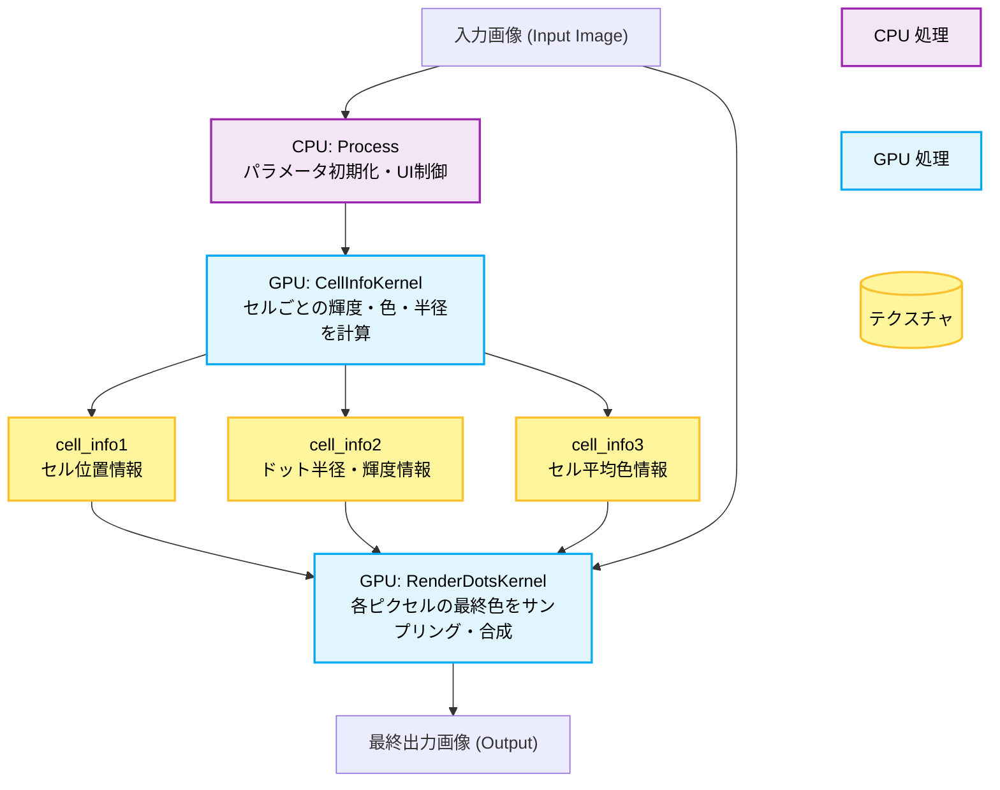

# MugSimpleHalftone.fuse 技術仕様書

## 1. 概要 (Overview)

`MugSimpleHalftone.fuse` は、DaVinci Resolve/Fusion 向けの高品質なリアルタイム・ハーフトーン生成プラグイン (v3.00) です。
六角形グリッドに基づくドットパターンを用いて、印刷物のような視覚的特徴（網点表現）をシミュレートします。

OpenCL を活用した強力な GPU アクセラレーションにより、4K・8K 高解像度環境でもリアルタイムのパフォーマンスを提供します。単純な白黒のドット化にとどまらず、カラーハーフトーン、ドットゲイン（インクの滲み）、ドットの形状制御、ジッター（印刷ムラ）、アンチエイリアスといった高度な描画モジュールを備えています。

### 主な特徴
- **六角形ドットグリッド**: 自然で隙間の少ない、伝統的な印刷物に近いアプローチ。
- **ドット形状バリエーション**: 円形（Circle）、四角形（Square）、ひし形（Diamond）からドットの形状を選択可能。
- **アナログ印刷のシミュレート（Jitter）**: 擬似乱数を用いた位置ズレ（Position Jitter）とサイズムラ（Size Jitter）による、有機的でアナログな不完全さの再現。
- **柔軟なトーン制御**: 輝度反転、ドットゲイン補正、非線形なドットサイズカーブによる緻密なコントラスト設計。
- **高品質なエッジ処理**: セル距離に基づく計算とソフトネス調整が可能なアンチエイリアス処理。
- **カラー表現と版ズレ (RGB Shift)**: ユーザー定義色や入力画像の直接合成に加え、RGBチャンネルを物理的にズラしてサンプリングする「見当ズレ・色収差」のシミュレーション機能。
- **ダイナミックな最適化**: 解像度やスクリーン密度（網点の細かさ）に応じた動的なサンプリング間引きと、不要ピクセルの計算スキップ（高密度モード）。

---

## 2. アーキテクチャと処理フロー (Architecture & Processing Flow)

プラグインの実行プロセスは、DaVinci Resolve の UI パラメータを解釈する CPU 処理 (`Process()` 関数) と、画像処理の重い負荷を担う 2つの GPU カーネル (`CellInfoKernel`, `RenderDotsKernel`) で構成されます。

### 処理の2段階構造
1. **CellInfoKernel (セル情報の抽出)**: 
   全ピクセルではなく「ドット1つ分（セル）」ごとにスレッドが走ります。セルが受け持つ入力画像の領域を円形サンプリングして、そのセルの平均輝度・平均色を求め、このセルに描画すべきドットの「半径」を算出します。
2. **RenderDotsKernel (最終画像の描画)**: 
   全ピクセルごとにスレッドが走ります。自分がどのセルのドットに含まれるか（または隣接セルのドットが自分に被ってくるか）を計算し、最終的な出力色と透明度を決定します。

---

## 3. GPU カーネルの設計詳細とデータ構造 (GPU Kernel Design Details)

CPUからカーネルへ情報を中継し、2つのカーネル間でデータを共有するために、3つの浮動小数点テクスチャバッファ（`cell_info1, 2, 3`）を使用します。

### cell_info バッファの仕様

| バッファ | チャンネル | 格納されるデータ | 役割の説明 |
| :--- | :--- | :--- | :--- |
| **cell_info1** | `.x` | `cellIDX` | グリッド座標系でのX位置 (0〜dstSize[0]-1) |
| | `.y` | `cellIDY` | グリッド座標系でのY位置 (0〜dstSize[1]-1) |
| | `.z` | `cellCenterX` | ピクセル座標系でのセル中心のX座標 |
| | `.w` | `cellCenterY` | ピクセル座標系でのセル中心のY座標 |
| **cell_info2** | `.x` | `avgLuma` | コントラスト調整後の平均輝度 (0.0〜1.0) |
| | `.y` | `dotRadius` | セルに描画すべきドットの半径 (ピクセル単位) |
| | `.z` | `isOddRow` | 行オフセットフラグ。六角形グリッドの奇数行ズレ判定用 (1=オフセット) |
| | `.w` | (予約済み) | 常に 1.0 (将来のドット形状拡張用) |
| **cell_info3** | `.x` | `avgColor.R` | セル円形範囲内の平均色の赤成分 (0.0〜1.0) |
| | `.y` | `avgColor.G` | 平均色の緑成分 (0.0〜1.0) |
| | `.z` | `avgColor.B` | 平均色の青成分 (0.0〜1.0) |
| | `.w` | `avgColor.A` | 平均色のアルファ成分 (透明度) |

GPU 側でセルの幅や高さを算出し（`screenDensity` に基づく）、これらのバッファに一度書き出すことで、描画カーネル (`RenderDotsKernel`) では高負荷な画像サンプリングを再度行う必要がなく、近傍セルのデータをテクスチャフェッチするだけで済みます。

---

## 4. ドット生成のメカニズム (Mechanism of Dot Generation)

ドットが生成されるプロセスは、5つの主要なステージに分解されます。各UIパラメータが内部でどのように数式化されているかを詳述します。

### ステージ 1: セルグリッド設計 (Screen Density)
UI からの `Screen Density` を基に、六角形グリッド構成のピッチ（間隔）をカーネル内で算出します。
六角形を作るため、Y方向のピッチは $X \times \frac{\sqrt{3}}{2}$ となります（コード内では定数 `SIN60 = 0.866025` を乗算）。

*奇数行 (`isOddRow`) は常にX方向に半セル分オフセットされ、蜂の巣状（ハニカム）の配置を実現します。*

### ステージ 2: 輝度統計とトーン正規化 (Contrast / Invert / Dot Gain / Curve)
`CellInfoKernel` はセル範囲内を「円形サンプリング」して平均輝度を算出します。
その後、各種パラメータで補正をかけ、$T$ (Tonal Value) を生成します。

1. **基本輝度**: $L = 0.3R + 0.59G + 0.11B$
2. **Contrast**: $L_{adj} = \mathrm{saturate}(0.5 + (L - 0.5) \times \text{Contrast})$
3. **Invert Brightness**: 反転モードの場合 $T_0 = L_{adj}$、通常は $T_0 = 1.0 - L_{adj}$
4. **Dot Gain**: $T_1 = \mathrm{saturate}(T_0 + \text{DotGain})$
5. **Dot Size Curve**: $T = \mathrm{saturate}(T_1)^{\max(\text{DotSizeCurve}, \, 10^{-4})}$

### ステージ 3: 半径決定とカットオフ (Cutoffs & Max Radius)
導き出された $T$ を用いて実際のドット半径 ($R_{dot}$) を算出し、`cell_info2.y` に格納します。

1. **Brightness Cutoff**: 反転モードでない場合、$L_{adj} \le \text{BrightnessCutoff}$ のセルのみ描画を許可します（条件外は $R_{dot}=0$）。
2. **Cutoff Dot Radius (MinDotRadius)**: 計算された仮の半径が $\text{MinDotRadius}$ 未満であれば、ノイズとみなして $R_{dot}=0$ にします。
3. **最大限界値 (Clip Dot Radius)**: 極端なインク溜まりを防ぐため、物理的な最大セル半径 (`maxCellRadius`) に上限比率 (`ClipDotRadius`) を掛けた値でクランプします。
$$ R_{dot} = \min(T \times \text{maxCellRadius},\; \text{maxCellRadius} \times \text{ClipDotRadius}) $$

### ステージ 4: 描画側のピクセルカバレッジとAA (Antialias)
今度は `RenderDotsKernel` 側の処理です。各ピクセルは、自分が属するメインセルと「周囲の隣接セル（最大6つ）」から、自分に被さるドット半径情報を取得します。

UIで設定された `Dot Shape` に応じて、中心座標からの距離 $d$ の計算式（距離メトリクス）が切り替わります。
- **Circle (円)**: $d = \sqrt{\Delta x^2 + \Delta y^2}$
- **Square (四角)**: $d = \max(|\Delta x|, |\Delta y|)$
- **Diamond (ひし形)**: $d = (|\Delta x| + |\Delta y|) \times 0.707$

最も強く被さるドット（Coverage が最大のもの）を探します。選択された距離 $d$ を用いて、カバレッジ $\alpha$ は以下のように計算されます。
- `Enable Dot Antialias` **オフ**: $d \le R_{dot}$ なら $1.0$、それ以外は $0.0$。
- `Enable Dot Antialias` **オン**: エッジの羽ばたき幅（ソフトネス）を $w = \text{AAEdgeSoftness} \times \text{averageCellPitch}$ として、
$$ \alpha = \mathrm{saturate}\left( \frac{R_{dot} - d}{w} \right) $$
*(半径より内側の完全な中心部は $1.0$ になります)*

### ステージ 5: 最終色の合算 (Color Blending)
最終的な描画色は「背景 (BaseColor)」と「ドット色 (DotColor)」をカバレッジでアルファ合成 (`blendDotOver`) します。

- **DotColor**: `Use Original Color` がオンなら `cell_info3` の平均色($\mathrm{RGB}$)を使用します。オフならUIの `Dot Color` の単色を使用します。この際、`RGB Shift` パラメータが設定されていると、R・G・B成分をそれぞれ異なる座標へズラしてサンプリングし、版ズレ（フリンジ）を発生させます。
- **BaseColor**: `Blend With Input` がオンなら元の入力画像をベースとし（こちらにも `RGB Shift` が適用可能）、オフなら `Paper Color`（プリセットまたはカスタム指定色）を使用します。

---

## 5. UI パラメータリファレンス (UI Parameter Reference)

DaVinci Resolve のインスペクタに表示される全パラメータの一覧です。

| セクション | パラメータ名 | デフォルト | 範囲 | 説明 |
| :--- | :--- | :--- | :--- | :--- |
| **Main** | Screen Density | 200.0 | 1 - 1000.0 | 画面全体のセルの細かさ。値が大きいほどドットが細密になります。 |
| | Contrast | 1.0 | 0.1 - 15.0 | 元画像のコントラストを増減させます。ドット化のメリハリに直結します。 |
| | RGB Shift (Req. Orig Color/Blend) | 0.0 | 0.0 - 20.0 | 指定ピクセル分RGBチャンネルをズラしてサンプリングし、色収差や版ズレを再現します。 |
| **Dot** | Dot Shape | Circle | Dropdown | ドットの形状（Circle, Square, Diamond）を選択します。 |
| | Dot Aspect Ratio | 0.0 | -1.0 - 1.0 | ドットの基本の縦横比。正の値で縦長（最大4倍）、負の値で横長（最大1/4倍）になります。 |
| | Dot Gain | 0.0 | -1.0 - 1.0 | 紙に滲んでドットが太る（またはかすれて細る）オフセットバイアスです。 |
| | Dot Size Curve | 1.0 | 0.01 - 5.0 | ドットサイズの成長カーブです。1.0で線形。大きな値で暗部を中心にドットが付きます。 |
| | Cutoff Dot Radius | 0.05 | 0.0 - 1.0 | 描画する最小のドット半径。これ未満のゴミのようなドットを排除します。 |
| | Clip Dot Radius | 1.0 | 0.0 - 1.0 | ドットの最大サイズの上限クリップ値です。 |
| | Position Jitter | 0.05 | 0.0 - 1.0 | 網点グリッドの中心位置をランダムにずらし、印刷ズレをシミュレートします。 |
| | Size Jitter | 0.02 | 0.0 - 1.0 | 各ドットの大きさをランダムに増減させ、インクのムラをシミュレートします。 |
| | Aspect Jitter | 0.0 | 0.0 - 1.0 | 各ドットの縦横比を個別にランダムにブレさせる強さ。 |
| | Invert Brightness | 0 (Off) | Checkbox | オンにすると、明るい部分のドットが大きく、暗い部分のドットが小さくなります。 |
| | Brightness Cutoff | 0.75 | 0.0 - 1.0 | ドットを配置する明度の限界値（白飛びの領域など）。 |
| | Enable Dot Antialias | 1 (On) | Checkbox | ドットの境界を滑らかにフェザー（ぼかし）処理するかどうか。 |
| | AA Edge Softness | 0.15 | 0.0 - 1.0 | アンチエイリアス境界の幅。セルピッチに対する比率です。 |
| | Use Original Color | 0 (Off) | Checkbox | ドット色として、元の入力画像のピクセルカラーを採用します。 |
| | Dot Color (R/G/B/A) | 0.06,0.01,0,1 | 0.0 - 1.0 | Use Original Color がオフの時に使用される前景色（濃い茶など）。 |
| **Paper** | Blend With Input | 0 (Off) | Checkbox | 紙色を無視して、生成したドットパターンを元の入力画像に直接オーバーレイ合成します。 |
| | Paper Color Preset | Custom | Dropdown | Newspaper, Vintage などの一般的な紙の背景色をワンクリックで適応します。 |
| | Paper Color (R/G/B/A)| 0.85,0.75,0.58,1 | 0.0 - 1.0 | 背景色（紙の色）。手動で指定できます。プリセット選択時は自動上書きされます。 |

---

## 6. パフォーマンスと最適化戦略 (Performance & Optimization)

本プラグインは、OpenCL 上でのリアルタイム駆動を大前提としており、以下の最適化アルゴリズムが組み込まれています。

1. **空間サンプリングの間引き (CellInfoKernel)**
   `Screen Density` の値が極端に低く、一つのセル半径が非常に大きくなる場合 (`SAMPLING_STEP_THRESHOLD` = 12.0 以上)、全ピクセルを走査すると非常に重くなります。この場合、サンプリングを2ピクセル（`SAMPLING_STEP_LARGE` = 2）ごとにスキップしつつ、取得ウェイトを自動補正して高速に近似値を算出します。

2. **高密度モード時の走査削減 (RenderDotsKernel)**
   描画時、ピクセルが「自分に被さるドット」を探すために隣接6方向を走査します。しかし `HIGH_DENSITY_THRESHOLD` のようにセルが非常に小さい（半径が `MIN_CHECK_RADIUS = 1.5` 以下）の環境では、隣の隣など遠くのセルまでチェックする必要がなくなります。この場合、条件分岐によって周囲全6方向ではなく、「自分の座標から一番近い最大2方向」のみをチェックし、VRAMアクセスコストを大きく引き下げています。

3. **PCGベースのアーキテクチャ非依存整数ハッシュ PRNG**
   Jitter機能（位置やサイズのランダム変動）を実装する際、`sin` や `fract` などの超越関数を用いた浮動小数点ハッシュはGPUアーキテクチャ（CUDA, Metal, OpenCL）ごとに精度による微小な差異やアーティファクトを引き起こします。本プラグインでは完全なビット演算（PCGハッシュベース）のみによる決定論的整数の擬似乱数ジェネレーター（PRNG）を独自実装し、どの環境でも数学的に完全に一致するノイズパターンをノーコストで生成します。

4. **早期リターン処理**
   `CellInfoKernel` では円形範囲外のピクセルアクセスを避けるための境界ボックスと平方根回避（二乗比較への置き換え）を導入。
   また、ドット半径が閾値 (`DOT_RADIUS_THRESHOLD = 0.1`) 未満の描画をスキップすることでアイドルスレッドを早々に終了させます。

---

## 7. 実践的な使い方・Tips (Practical Use Cases & Tips)

### アメリカンコミック / ポップアート風
- **Screen Density:** `60〜80` (かなり粗め)
- **Use Original Color:** `On`
- **Dot Size Curve:** `1.2` 〜 `1.5` (少しコントラストを硬くする)
- **Paper Color Preset:** `Pure White` にしつつ、必要に応じて背景にベタ塗り映像を敷く。

### 古い新聞記事 (Newspaper Print)
- **Screen Density:** `150〜180`
- **Use Original Color:** `Off` (単色の黒インク)
- **Dot Gain:** `0.05 〜 0.1` (インクの染み出しを模倣)
- **Brightness Cutoff:** `0.85`
- **Paper Color Preset:** `Newspaper` (わずかに黄ばんだ再生紙風)

### 網点の「穴」を抜く表現
黒いドットで表現するのではなく、「黒い紙から白いドットの穴を抜く」ような逆転現象を作りたい場合：
- **Invert Brightness:** `On`
- **Dot Color:** 白やグレー
- **Paper Color:** 黒や暗色
- **Clip Dot Radius:** `0.85` (最大ドットを少し抑えることで、完全に白く潰しきらず穴感を残す)

---

## 8. 技術的制約と今後の展望 (Constraints & Future Scope)

- **GPU制約**: DaVinci Resolve の OpenCL/CUDA 環境を強く前提としたハードウェア実装です。CPUへのフォールバック機能はありません。
- **解像度と密度の限界**: `Screen Density` を法外な数値に引き上げたり、16Kのような異常解像度で使用する場合、テクスチャメモリのフェッチ回数が並行処理の上限を突破し、フレームドロップが発生する可能性があります。
- **将来の拡張**: 現在未使用の `cell_info2.w` チャンネルなどを活用し、単なる円形ドットだけでなく「ライン（線・トーン）」「クロスハッチング」といった別の描画アルゴリズムの拡張を計画できる設計基盤となっています。

---
*Generated based on source code MugSimpleHalftone.fuse v3.00*
