# MugSimpleHalftone.fuse 技術仕様書

## 概要

MugSimpleHalftone.fuse は、DaVinci Resolve/Fusion 用の高性能なハーフトーンエフェクトプラグインです。六角形グリッドベースのドット配置により、印刷物風のハーフトーン効果を生成します。GPU アクセラレーション（OpenCL）を使用し、リアルタイムでの高品質なレンダリングを実現します。v2.41 では「Invert Brightness」オプションが追加され、明るい領域を強調するハイライト寄りの表現も可能になりました。

## アーキテクチャ概要

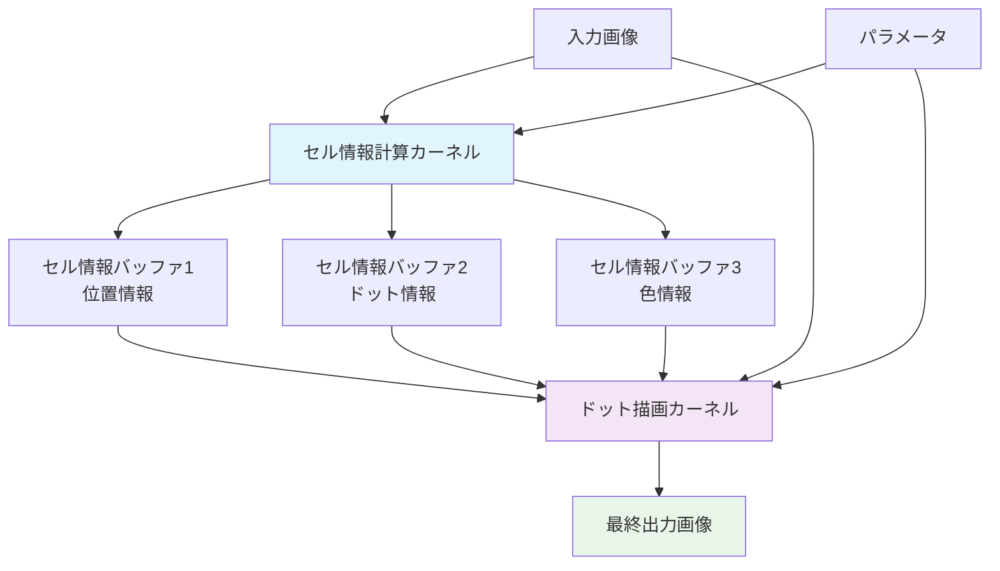

## メイン処理フロー

### 1. 全体処理フロー

Fusion から渡される入力画像と UI パラメータは `Process()` に集約され、セル解析（`CellInfoKernel`）と描画（`RenderDotsKernel`）を 2 段階で実行します。パラメータは処理ステージごとに評価され、値の一部は GPU カーネルへ定数としてバンドルされます。

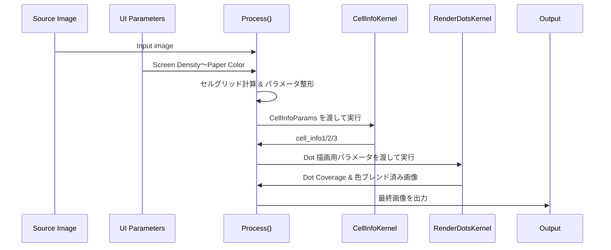

### 1-1. パラメータ駆動の処理ステージ

ドット生成は次の 6 ステージで進み、各ステージが該当パラメータを順に適用します。式中の $L$ はセル輝度、$R_{\max}$ はセルが取り得る最大半径です。

1. **セルグリッド生成 — Screen Density**  
   `Screen Density` は水平方向のセル数を指定し、六角グリッドのピッチ $p_x$ と $p_y$ を決定します。ピッチは `CellInfoKernel` と `RenderDotsKernel` の両方で共有され、後段のサンプリング半径やアンチエイリアス幅の基準になります。
2. **輝度統計と正規化 — Contrast**  
   サンプリングした平均輝度 $L$ は $L' = 0.5 + (L-0.5)\times\text{Contrast}$ でリマップし、`Contrast` が高いほどシャドウとハイライトを強調します。ここで得た $L'$ が以後のトーン計算の基礎になります。
3. **トーン生成 — Invert Brightness / Dot Gain / Dot Size Curve**  
   `Invert Brightness` がオフなら $T_0 = 1 - L'$, オンなら $T_0 = L'$ で極性を切り替えます。続いて `Dot Gain` で $T_1 = \mathrm{saturate}(T_0 + \text{DotGain})$ の線形オフセット、`Dot Size Curve` で $T_2 = \mathrm{saturate}(T_1)^{\max(\text{DotSizeCurve},10^{-4})}$ の非線形リマップを行い、ハイライト・シャドウどちらにドットを残すかを制御します。
4. **描画許可と半径制御 — Brightness Cutoff / Cutoff Dot Radius / Clip Dot Radius**  
   `Brightness Cutoff` は $L'$ と閾値を比較し、条件を満たさないセルをゼロ半径にします。条件を満たしたセルは $\text{radius}_\text{raw} = T_2\times R_{\max}$ を計算し、`Cutoff Dot Radius` 未満ならノイズ抑制のため描画しません。最後に `Clip Dot Radius` を掛け上限 $R_{\max}\times\text{ClipDotRadius}$ に収め、極端な肥大化を止めます。
5. **境界サンプリング設計 — Enable Dot Antialias / AA Edge Softness**  
   `Enable Dot Antialias` がオンの場合のみ後述のアンチエイリアス計算を有効化します。`AA Edge Softness` はセルピッチから求める幅 $w = \text{AAEdgeSoftness} \times p_\text{avg}$ を与え、半径から内側バリアを引いた上でソフトなカバレッジ関数を構築します。オフの場合はハードなステップ関数が使用されます。
6. **色と紙の決定 — Use Original Color / Dot Color* / Blend With Input / Paper Color Preset / Paper Color***  
   `Use Original Color` がオンなら cell_info3 の平均色を採用し、オフなら `Dot Color` の RGBA（`Dot Color Red/Green/Blue/Alpha`）を使用します。`Blend With Input` がオンの場合は入力画像が背景、オフの場合は紙色が背景になります。紙色は `Paper Color Preset` でプリセットを選ぶか、`Paper Color Red/Green/Blue/Alpha` で直接指定します。これらの値は次節のブレンド処理で使用されます。

ステージ 1〜4 が `CellInfoKernel`、ステージ 5〜6 が `RenderDotsKernel` の主担当です。アンチエイリアスと色処理の詳細は以下の節で掘り下げます。

### 1-2. アンチエイリアス処理

`Enable Dot Antialias` がオンのセルには、ピクセルとセル中心の距離 $d$ に基づいてカバレッジを計算します。セルピッチから算出した幅 $w = \text{AAEdgeSoftness} \times p_\text{avg}$ を使い、

1. 内側半径を $r_{\text{inner}} = \max(r - w,\, 0)$ と定義。
2. $d \le r_{\text{inner}}$ ならカバレッジ 1、$d \ge r$ なら 0。
3. それ以外は $\mathrm{saturate}\Big(\dfrac{r - d}{w}\Big)$ で滑らかに減衰。

`Enable Dot Antialias` がオフ、または半径が `DOT_RADIUS_THRESHOLD` 未満のセルはハードエッジ（0/1）のみを使用します。選ばれたカバレッジは近傍セルの中で最も強いドットに限定して適用され、次節の色ブレンドに渡されます。

### 1-3. 色とブレンド

最終色は紙色／入力画像／ドット色の 3 者合成で決まります。

1. **ドット色の選択** — `Use Original Color` がオンのときはセル平均色に $(1-L')$ を掛け、暗部ほど濃くなるよう調整します。オフのときは `Dot Color Red/Green/Blue` と `Dot Color Alpha` がそのまま使用されます。
2. **背景ベースの決定** — `Blend With Input` がオンなら入力ピクセルがベース。オフなら `Paper Color Preset` の選択値で `Paper Color Red/Green/Blue/Alpha` を上書きし、その RGBA を背景として採用します。`Paper Color Alpha` を 1 未満に設定すれば、背景と入力の合成を意図的に透過させることもできます。
3. **合成** — `RenderDotsKernel` 内の `blendDotOver()` で $\text{Final} = (1-\alpha_\text{dot})\times\text{Base} + \alpha_\text{dot}\times\text{DotColor}$ を計算します。$\alpha_\text{dot}$ はアンチエイリアスで得たカバレッジと `Dot Color Alpha` の積です。

これらの結果が GPU テクスチャとして戻り、`Process()` が Fusion へ最終画像を返します。

### 2. セルグリッド計算

六角形配置のセルグリッドは以下の計算で決定されます：

```lua
-- セルピッチ計算
local SIN60 = 0.866025  -- √3/2
local cellBasePitch = floor(max(3.0, width / screenDensity))
local cellPitchX = cellBasePitch
local cellPitchY = floor(max(3.0, cellBasePitch * SIN60))

-- グリッドサイズ
local cellGridNumX = ceil(width / cellPitchX) + 3
local cellGridNumY = ceil(height / cellPitchY) + 2
```

## GPU カーネル詳細

### CellInfoKernel（セル情報計算）

このカーネルは各セルの基本情報を計算し、3 つの情報バッファに格納します。

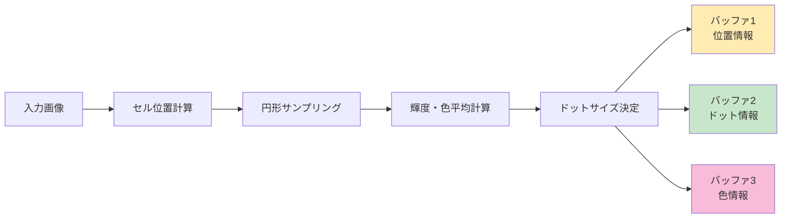

#### セル情報バッファの構造

**cellInfo1 (位置情報)**

- `x`: セル IDX (グリッド座標 X)
- `y`: セル IDY (グリッド座標 Y)
- `z`: セル中心位置 X (ピクセル座標)
- `w`: セル中心位置 Y (ピクセル座標)

**cellInfo2 (ドット情報)**

- `x`: セル輝度値 (0.0-1.0)
- `y`: ドット半径 (ピクセル単位)
- `z`: 行オフセットフラグ (0=通常行, 1=オフセット行)
- `w`: 予約済み (将来拡張用)

**cellInfo3 (色情報)**

- `x`: 元の色 R 成分 (0.0-1.0)
- `y`: 元の色 G 成分 (0.0-1.0)
- `z`: 元の色 B 成分 (0.0-1.0)
- `w`: 元の色 A 成分 (透明度)

#### 六角形グリッド配置

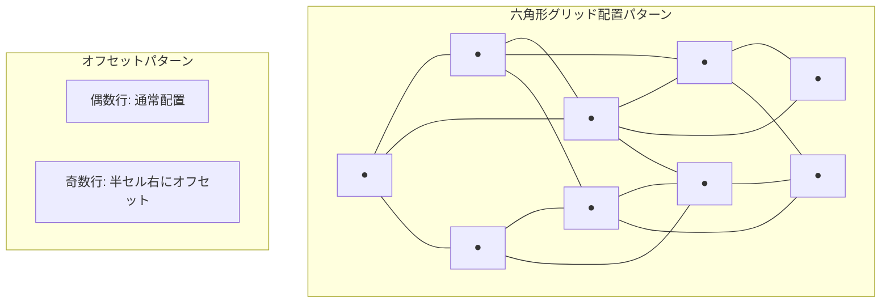

#### 円形サンプリング最適化

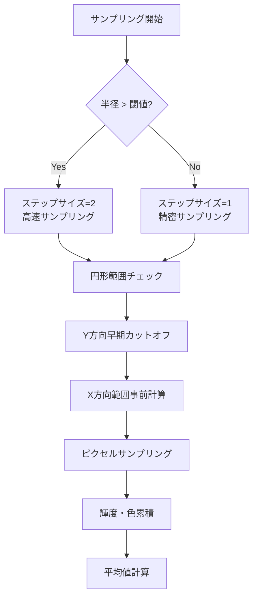

### RenderDotsKernel（ドット描画）

各ピクセルが属するセルとその周辺セルを検索し、ドットの描画を行います。

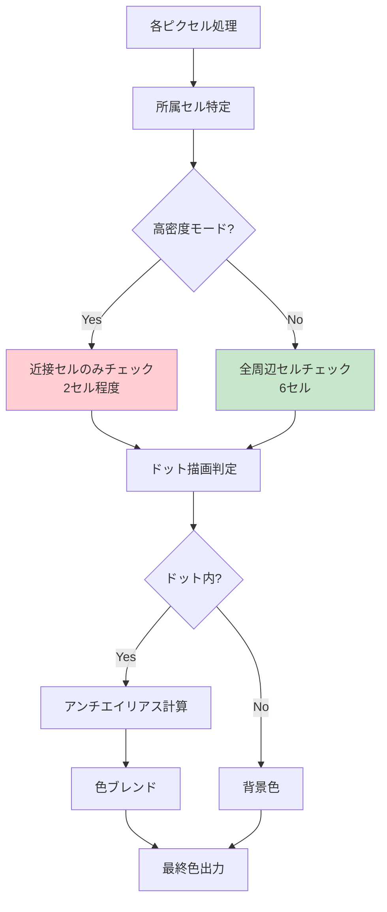

#### 隣接セル検索パターン

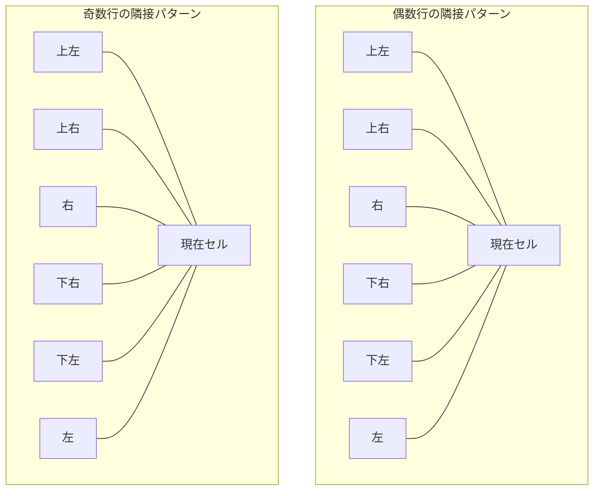

## パラメータ詳細

### 基本パラメータ

| パラメータ        | デフォルト | 範囲     | 説明                                                                       |
| ----------------- | ---------- | -------- | -------------------------------------------------------------------------- |
| Screen Density    | 150.0      | 1-1000   | ハーフトーンパターンの密度                                                 |
| Contrast          | 1.0        | 0.1-15.0 | コントラスト調整                                                           |
| Dot Gain          | 0.0        | -1.0-1.0 | インクの滲み効果シミュレート                                               |
| Invert Brightness | Off        | 0 or 1   | 明るい領域ほどドットを大きくする（閾値判定も反転）                         |
| Brightness Cutoff | 0.75       | 0.0-1.0  | ドットの描画条件を決める明度閾値（Invert Brightness 有効時は明部側で判定） |
| Cutoff Dot Radius | 0.05       | 0.0-1.0  | 描画しない最小ドット半径                                                   |
| Clip Dot Radius   | 1.0        | 0.0-1.0  | ドットの最大サイズ制限                                                     |

### 視覚効果パラメータ

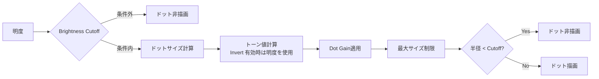

### 色設定

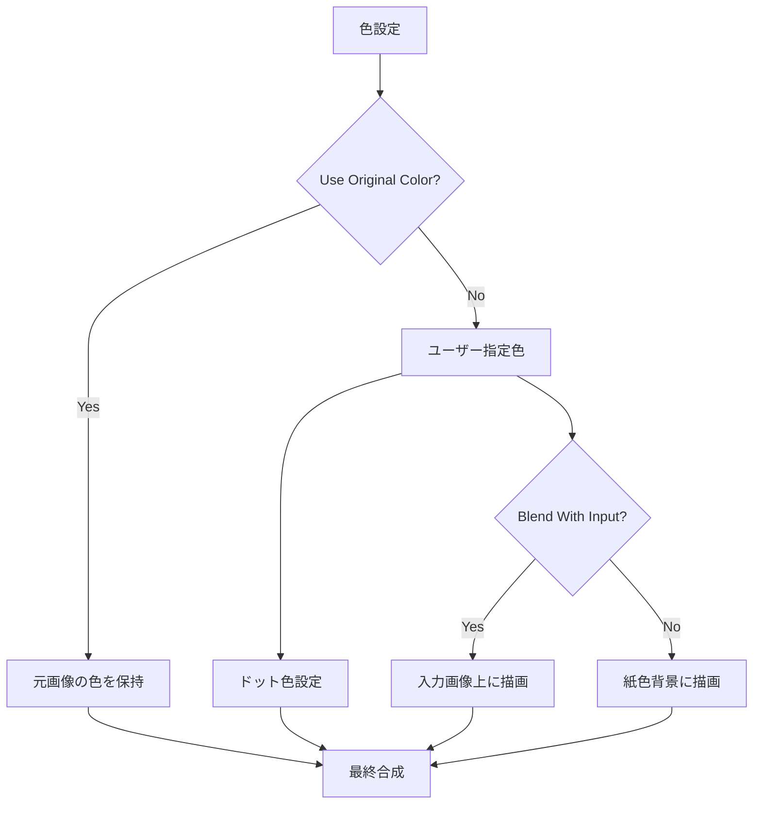

## アンチエイリアシング

小さなドットの境界を滑らかに保つため、RenderDotsKernel では距離ベースのカバレッジ計算と段階的な減衰を組み合わせたアンチエイリアシングを行います。

### カバレッジ計算の流れ

- ドット半径 `dotRadius` に対して、`AA Edge Softness` パラメータから算出した実効エッジ幅 `aaEdgeWidth` を適用し、内側境界 `innerRadius = max(dotRadius - aaEdgeWidth, 0)` を定義します。
- ピクセルの距離二乗 `distSq` が `dotRadius^2` を超えればカバレッジは 0。`innerRadius^2` より小さければ 1。境界帯に入った場合は $\text{coverage} = \text{saturate}\Big(\dfrac{dotRadius - dist}{aaEdgeWidth}\Big)$ を用いた線形フェードで 0-1 の値を作ります。
- `aaEdgeWidth` が 0、またはドット半径が `DOT_RADIUS_THRESHOLD` 以下の場合はアンチエイリアスをスキップし、カバレッジはステップ関数として扱います。

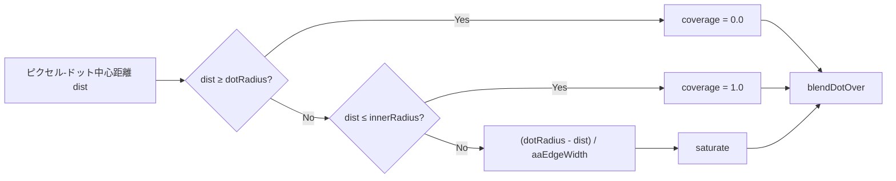

### 重なり合うドットの優先判定

- 各ピクセルは所属セルに加えて最大 6（高密度時は 2）つの隣接セルからの候補ドットを評価します。
- `checkCellDot()` が返すカバレッジ（エッジ減衰後の 0-1 値）に、オリジナルカラー使用時は「暗い色ほど強い」となるよう $1-\text{luma}$ を掛け合わせ、`bestStrength` として保持します。
- `bestStrength` が大きい候補、同値の場合はカバレッジが大きい候補が選択され、`blendDotOver()` で紙色／入力画像の上に 1 枚のドットとしてブレンドされます（複数ドットの加算合成を避け、にじみや過剰な濃度を防止）。
- AA 処理はこの最終的に選ばれたドットに対してのみ適用されるため、隣接セルが重なっても境界のフェザリング幅は維持されます。

### 実装上の考慮

- バウンディングボックス（`dotRadius + margin + aaEdgeWidth`）で不必要な距離計算を除外し、AA のコストを局所化しています。
- ピクセルごとに平方根計算を遅延させ、`distSq` 比較で早期リターンすることで、アンチエイリアスを有効にしても GPU の負荷が過剰に増えないようにしています。
- `AA Edge Softness` はセルピッチの平均に基づいて物理的なピクセル幅へ変換されるため、スクリーン密度を変えてもアンチエイリアス幅の感覚が大きくズレない設計です。

### 視覚比較サマリー（GitHub プレビュー対応）

| 距離カテゴリ     | ピクセル距離の状態               | カバレッジ値 | ドットの見え方 | 説明                                                                                    |
| ---------------- | -------------------------------- | ------------ | -------------- | --------------------------------------------------------------------------------------- |
| 中心コア         | $dist \le innerRadius$           | 1.00         | `⬤`            | 完全に塗りつぶされた領域。ブレンド時もドット色がそのまま適用されます。                  |
| 滑らかなエッジ帯 | $innerRadius < dist < dotRadius$ | 0.01〜0.99   | `◐`            | 距離に応じた減衰でフェザー状に見える領域。AA Edge Softness が広いほど滑らかになります。 |
| 外側             | $dist \ge dotRadius$             | 0.00         | `○`            | カバレッジ 0 のため背景色のみが残ります。                                               |

### 候補セルの視覚フロー

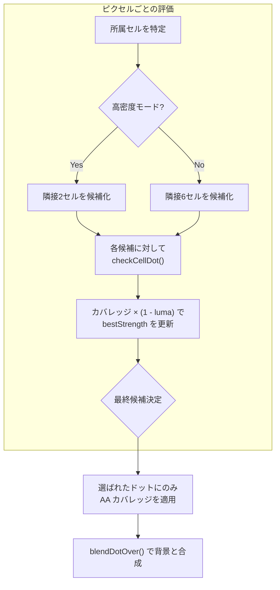

上図の通り、重なり合う領域でも最終的に 1 つの候補ドットが選ばれ、アンチエイリアスはそのドットのみに適用されます。

## 最適化技術

### 1. GPU 並列処理最適化

- **バウンディングボックス**: ドット周辺のみを計算対象とする
- **早期リターン**: 計算不要なケースの高速スキップ
- **ベクトル演算**: SIMD 命令活用による高速化

### 2. メモリアクセス最適化

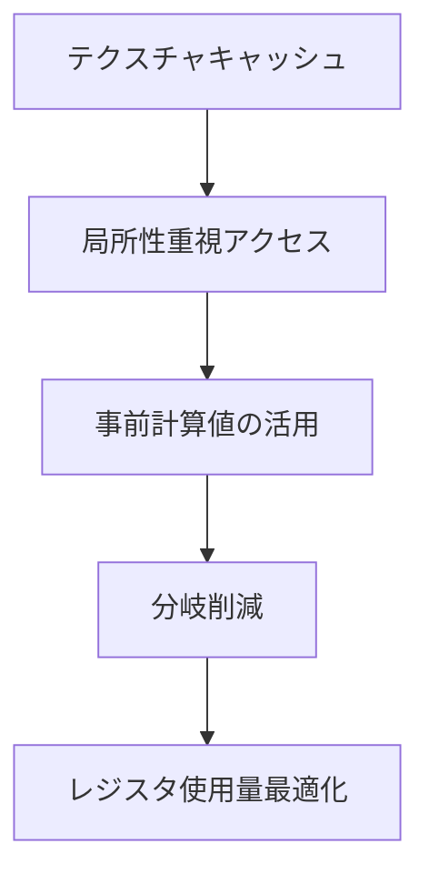

### 3. 動的品質調整

- **高密度モード**: 密度に応じて隣接セルチェック数を調整
- **サンプリング最適化**: 半径に応じてサンプリングステップを調整

## 使用例と Tips

### 基本的な使用方法

1. **新聞風効果**: Screen Density = 80-120, Use Original Color = Off
2. **雑誌風効果**: Screen Density = 150-200, Use Original Color = On
3. **アート効果**: Screen Density = 50-80, Dot Gain = 0.2-0.5
4. **ハイライト強調**: Invert Brightness = On, Brightness Cutoff = 0.7-0.9, Dot Gain = -0.1~-0.3

### パフォーマンス最適化

- 高解像度画像では Screen Density を下げる
- リアルタイム再生時は Enable Dot Antialias を無効にする
- Original Color 使用時は、コントラストを適切に調整する

## 技術的制約

- OpenCL 対応 GPU 必須
- 最大解像度: GPU VRAM に依存
- セルグリッド最大サイズ: 理論上無制限（実際はメモリ制約）

## 拡張可能性

現在の実装は将来的な機能拡張を考慮して設計されています：

- cellInfo2.w フィールド（予約済み）
- 追加のブレンドモード
- カスタムドット形状
- マルチレイヤー対応

---

_このドキュメントは MugSimpleHalftone.fuse v2.60 に基づいて作成されています。_
