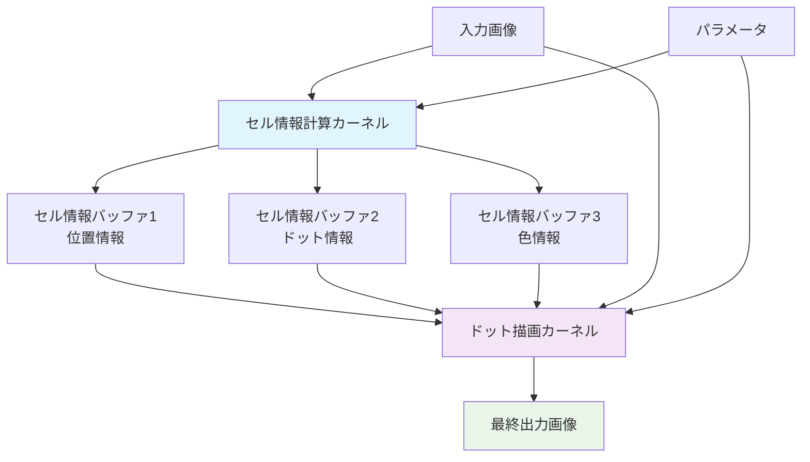
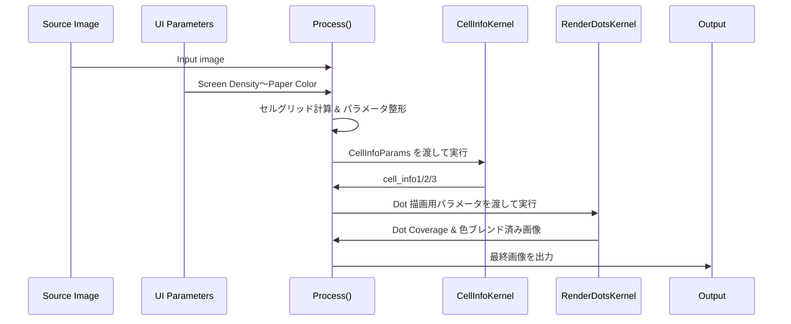
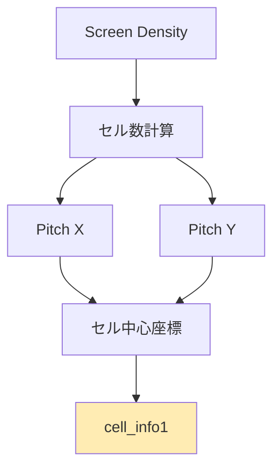
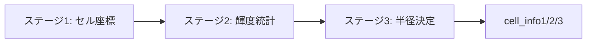
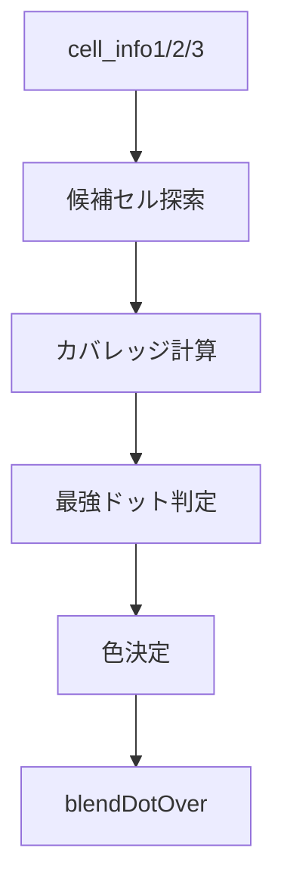
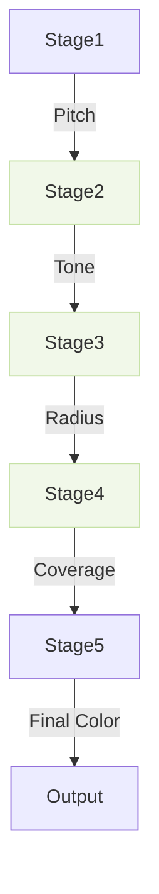

# MugSimpleHalftone.fuse 技術仕様書

## 概要

MugSimpleHalftone.fuse は、DaVinci Resolve/Fusion 用の高性能なハーフトーンエフェクトプラグインです。六角形グリッドベースのドット配置により、印刷物風のハーフトーン効果を生成します。GPU アクセラレーション（OpenCL）を使用し、リアルタイムでの高品質なレンダリングを実現します。v2.41 では「Invert Brightness」オプションが追加され、明るい領域を強調するハイライト寄りの表現も可能になりました。

## アーキテクチャ概要



## メイン処理フロー

### 1. 全体処理フロー

Fusion から渡される入力画像と UI パラメータは `Process()` に集約され、セル解析（`CellInfoKernel`）と描画（`RenderDotsKernel`）を 2 段階で実行します。パラメータは処理ステージごとに評価され、値の一部は GPU カーネルへ定数としてバンドルされます。



### 1-1. パラメータ駆動の処理ステージ

ドット生成は次の 6 ステージで進み、各ステージが該当パラメータを順に適用します。式中の $L$ はセル輝度、$R_{\max}$ はセルが取り得る最大半径です。

1. **セルグリッド生成 — Screen Density**  
   `Screen Density` は水平方向のセル数を指定し、六角グリッドのピッチ $p_x$ と $p_y$ を決定します。ピッチは `CellInfoKernel` と `RenderDotsKernel` の両方で共有され、後段のサンプリング半径やアンチエイリアス幅の基準になります。
2. **輝度統計と正規化 — Contrast**  
   サンプリングした平均輝度 $L$ は $L' = 0.5 + (L-0.5)\times\text{Contrast}$ でリマップし、`Contrast` が高いほどシャドウとハイライトを強調します。ここで得た $L'$ が以後のトーン計算の基礎になります。
3. **トーン生成 — Invert Brightness / Dot Gain / Dot Size Curve**  
   `Invert Brightness` がオフなら $T_0 = 1 - L'$, オンなら $T_0 = L'$ で極性を切り替えます。続いて `Dot Gain` で $T_1 = \mathrm{saturate}(T_0 + \text{DotGain})$ の線形オフセット、`Dot Size Curve` で $T_2 = \mathrm{saturate}(T_1)^{\max(\text{DotSizeCurve},10^{-4})}$ の非線形リマップを行い、ハイライト・シャドウどちらにドットを残すかを制御します。
4. **描画許可と半径制御 — Brightness Cutoff / Cutoff Dot Radius / Clip Dot Radius**  
   `Brightness Cutoff` は $L'$ と閾値を比較し、条件を満たさないセルをゼロ半径にします。条件を満たしたセルは $\text{radius}_\text{raw} = T_2\times R_{\max}$ を計算し、`Cutoff Dot Radius` 未満ならノイズ抑制のため描画しません。最後に `Clip Dot Radius` を掛け上限 $R_{\max}\times\text{ClipDotRadius}$ に収め、極端な肥大化を止めます。
5. **境界サンプリング設計 — Enable Dot Antialias / AA Edge Softness**  
   `Enable Dot Antialias` がオンの場合のみ後述のアンチエイリアス計算を有効化します。`AA Edge Softness` はセルピッチから求める幅 $w = \text{AAEdgeSoftness} \times p_\text{avg}$ を与え、半径から内側バリアを引いた上でソフトなカバレッジ関数を構築します。オフの場合はハードなステップ関数が使用されます。
6. **色と紙の決定 — Use Original Color / Dot Color* / Blend With Input / Paper Color Preset / Paper Color***  
   `Use Original Color` がオンなら cell_info3 の平均色を採用し、オフなら `Dot Color` の RGBA（`Dot Color Red/Green/Blue/Alpha`）を使用します。`Blend With Input` がオンの場合は入力画像が背景、オフの場合は紙色が背景になります。紙色は `Paper Color Preset` でプリセットを選ぶか、`Paper Color Red/Green/Blue/Alpha` で直接指定します。これらの値は次節のブレンド処理で使用されます。

ステージ 1〜4 が `CellInfoKernel`、ステージ 5〜6 が `RenderDotsKernel` の主担当です。アンチエイリアスと色処理の詳細は以下の節で掘り下げます。

### 1-2. アンチエイリアス処理

`Enable Dot Antialias` がオンのセルには、ピクセルとセル中心の距離 $d$ に基づいてカバレッジを計算します。セルピッチから算出した幅 $w = \text{AAEdgeSoftness} \times p_\text{avg}$ を使い、

1. 内側半径を $r_{\text{inner}} = \max(r - w,\, 0)$ と定義。
2. $d \le r_{\text{inner}}$ ならカバレッジ 1、$d \ge r$ なら 0。
3. それ以外は $\mathrm{saturate}\Big(\dfrac{r - d}{w}\Big)$ で滑らかに減衰。

`Enable Dot Antialias` がオフ、または半径が `DOT_RADIUS_THRESHOLD` 未満のセルはハードエッジ（0/1）のみを使用します。選ばれたカバレッジは近傍セルの中で最も強いドットに限定して適用され、次節の色ブレンドに渡されます。

### 1-3. 色とブレンド

最終色は紙色／入力画像／ドット色の 3 者合成で決まります。

1. **ドット色の選択** — `Use Original Color` がオンのときはセル平均色に $(1-L')$ を掛け、暗部ほど濃くなるよう調整します。オフのときは `Dot Color Red/Green/Blue` と `Dot Color Alpha` がそのまま使用されます。
2. **背景ベースの決定** — `Blend With Input` がオンなら入力ピクセルがベース。オフなら `Paper Color Preset` の選択値で `Paper Color Red/Green/Blue/Alpha` を上書きし、その RGBA を背景として採用します。`Paper Color Alpha` を 1 未満に設定すれば、背景と入力の合成を意図的に透過させることもできます。
3. **合成** — `RenderDotsKernel` 内の `blendDotOver()` で $\text{Final} = (1-\alpha_\text{dot})\times\text{Base} + \alpha_\text{dot}\times\text{DotColor}$ を計算します。$\alpha_\text{dot}$ はアンチエイリアスで得たカバレッジと `Dot Color Alpha` の積です。

これらの結果が GPU テクスチャとして戻り、`Process()` が Fusion へ最終画像を返します。

### 2. ステージ 1: セルグリッド設計（Screen Density）

ステージ 1 では `Screen Density` を核に、六角形グリッドのピッチとサンプリング範囲を決定します。セル間隔は GPU 側で次の式に従って算出され、以降のステージでも共有されます。

```lua
local SIN60 = 0.866025 -- √3/2
local cellBasePitch = floor(max(3.0, width / screenDensity))
local cellPitchX = cellBasePitch
local cellPitchY = floor(max(3.0, cellBasePitch * SIN60))
```

- `cellPitchX, cellPitchY` はそれぞれ横方向・縦方向のセル間隔で、六角格子の重なりを作るため縦方向のみ $p_y = \lfloor \max(3, p_x \times \sqrt{3}/2) \rfloor$ に変換します。
- 画素座標系でのセル中心は `Process()` が奇数行を半セル左にオフセットし、`CellInfoKernel` 内でも同じロジックを再現してピクセルサンプリングとの整合性を保ちます。
- バッファ外のアーティファクトを避けるため、グリッドサイズは `+3` 列・`+2` 行のマージンを持たせ、レンダリングステージが隣接セルを参照しても安全になるよう設計されています。



### 3. ステージ 2: 輝度統計とトーン正規化（Contrast / Invert / Dot Gain / Dot Size Curve）

ステージ 2 ではセル内サンプリングにより平均輝度と平均色を求め、トーン値を段階的に整形します。

1. **円形サンプリング** — セル中心から半径 $r_s = \lfloor p_x/2 \rfloor$ の円内を走査します。半径が `SAMPLING_STEP_THRESHOLD` を超える場合はサンプリングステップを 2 に間引き、ノイズを抑えつつ高速化します。
2. **平均輝度の抽出** — $L = \dfrac{1}{N} \sum (0.3R + 0.59G + 0.11B)$ を算出し、`Contrast` を使って $L' = 0.5 + (L-0.5) \times \text{Contrast}$ に再マップします。極端な値は `_saturatef` で 0〜1 にクリップされます。
3. **極性切り替え** — `Invert Brightness` が Off なら $T_0 = 1 - L'$, On なら $T_0 = L'$。どちらを太らせるかをここで決定します。
4. **ドットゲイン** — $T_1 = \mathrm{saturate}(T_0 + \text{DotGain})$ とし、印刷時の滲みを模したバイアスを全域に加えます。
5. **ドットサイズカーブ** — 非線形リマップ $T_2 = \mathrm{saturate}(T_1)^{\max(\text{DotSizeCurve}, 10^{-4})}$ を適用。値が 1 より大きいほどシャドウが細り、1 未満でハイライトが細ります。

CellInfoKernel はこの段階で `cell_info2.x` に輝度を保持し、計算中のトーン値はレジスタ上で管理したまま次の半径判定へ進みます。

### 4. ステージ 3: 描画許可と半径制御（Brightness Cutoff / Cutoff Dot Radius / Clip Dot Radius）

ステージ 3 では、ステージ 2 で得たトーン値から実際の半径を確定し、閾値による描画可否を判断します。

```lua
local passes = invertMode ~= 0
    and (avgLuma >= brightnessCutoff)
    or  (avgLuma <= brightnessCutoff)

local radius = 0.0
if passes then
    local raw = T2 * maxCellRadius
    if raw >= minDotRadius then
        radius = min(raw, maxCellRadius * clipRadius)
    end
end
```

- `Brightness Cutoff` はステージ 2 の $L'$ を閾値と比較し、描画するセルだけを残します。`Invert Brightness` が On の場合は比較方向が逆転します。
- `Cutoff Dot Radius` は微細ノイズを抑制する最小半径です。0 に近づけるほど背景に散る微小ドットが復活します。
- `Clip Dot Radius` は最大半径の上限を割合で指定し、インクが潰れたような過剰なドット拡大を抑えます。

確定した半径は `cell_info2.y` として GPU に保存され、ステージ 4・5 で使用されます。

### 5. ステージ 4: 境界サンプリングとアンチエイリアス（Enable Dot Antialias / AA Edge Softness）

ステージ 4 ではステージ 3 で得た半径をもとにピクセルカバレッジを計算します。

- `Enable Dot Antialias` はデフォルトでは Off。半径が `DOT_RADIUS_THRESHOLD` 以下の場合も含め、条件を満たさないときは 0/1 のステップ判定のみです。
- On の場合はセル平均ピッチ $p_{avg} = (p_x + p_y)/2$ からエッジ幅 $w = \text{AAEdgeSoftness} \times p_{avg}$ を求め、内側半径 $r_{inner} = \max(r - w, 0)$ を定義します。
- ピクセル中心との距離 $d$ に対し、
  - $d \le r_{inner}$ → カバレッジ 1
  - $r_{inner} < d < r$ → $\mathrm{saturate}\Big(\dfrac{r - d}{w}\Big)$
  - $d \ge r$ → カバレッジ 0

```mermaid
graph LR
    A[r, w, d] --> B{d ≤ r_inner?}
    B -->|Yes| C[coverage = 1]
    B -->|No| D{d ≥ r?}
    D -->|Yes| E[coverage = 0]
    D -->|No| F[coverage = (r - d)/w]
    F --> G[saturate]
```

候補セル間で最も強いカバレッジ（`coverage × (1 - luma)`）を持つものだけが採用され、RenderDotsKernel 内で `bestStrength` として保持されます。

### 6. ステージ 5: 色決定とブレンド（Use Original Color / Dot Color* / Blend With Input / Paper Color*）

最後のステージではドット色と背景色を決定し、アルファ合成を行います。

1. **ドット色の選択** — `Use Original Color` が On の場合、`cell_info3` に格納された平均色に $(1 - L')$ を掛け合わせ、暗部ほど優先度を高くします。Off の場合は `Dot Color Red/Green/Blue/Alpha` をそのまま使用します。
2. **背景の決定** — `Blend With Input` が On なら入力ピクセルの色がベース、Off なら紙色がベースになります。紙色は `Paper Color Preset` でプリセット選択後、`Paper Color Red/Green/Blue/Alpha` で最終的な RGBA を確定します。
3. **ブレンド** — `blendDotOver()` により $\text{Final} = (1-\alpha_{dot})\times\text{Base} + \alpha_{dot}\times\text{DotColor}$ を計算します。$\alpha_{dot}$ はカバレッジ値とドット色アルファの積です。

```mermaid
graph TD
    A[coverage] --> D[αdot]
    B[Dot Color] --> E[blendDotOver]
    C[Base (Input or Paper)] --> E
    D --> E
    E --> F[最終出力]
```

### 7. GPU カーネル詳細（ステージ対応）

#### CellInfoKernel（ステージ 1〜3）



- **出力バッファ**
  - `cell_info1` : セル座標と中心位置（ステージ 1）
  - `cell_info2.x` : 平均輝度 $L'$、`.y` : 半径（ステージ 2〜3）
  - `cell_info3` : 平均色 RGBA（ステージ 2）
- **パラメータバンドル**
  - `screenDensity` → セルピッチ計算
  - `contrast` → 輝度リマップ
  - `dotGain`, `dotCurve`, `brightnessCutoff`, `minDotRadius`, `clipRadius`, `invertMode` → トーン＆半径処理
  - `useOriginalColor` → 色サンプリング継続の有無

#### RenderDotsKernel（ステージ 4〜5）



- `EnableDotAntialias`, `AAEdgeSoftness` はステージ 4 用の実効幅に変換されます。
- `UseOriginalColor`, `Dot Color *`, `BlendWithInput`, `Paper Color *` はステージ 5 で展開されます。
- 候補セルは高密度モード（セル半径が小さい場合）で 2 件までに絞り込み、不要な距離計算を避けています。

### 8. パラメータリファレンス（ステージ別）

| ステージ | パラメータ                       | デフォルト | 範囲       | 役割                                    |
| -------- | -------------------------------- | ---------- | ---------- | --------------------------------------- |
| 1        | Screen Density                   | 150.0      | 1–1000     | セルピッチとグリッド数を決定            |
| 2        | Contrast                         | 1.0        | 0.1–15.0   | 平均輝度を強調/圧縮                     |
| 3        | Invert Brightness                | Off        | 0/1        | トーン極性の選択                        |
| 3        | Dot Gain                         | 0.0        | -1.0–1.0   | 線形バイアスでドット太り/痩せを調整     |
| 3        | Dot Size Curve                   | 1.0        | 0.01–5.0   | ハイライト/シャドウの残し方を非線形制御 |
| 3        | Brightness Cutoff                | 0.75       | 0.0–1.0    | ドット描画の有無を判定                  |
| 3        | Cutoff Dot Radius                | 0.05       | 0.0–1.0    | 描画を許可する最小半径                  |
| 3        | Clip Dot Radius                  | 1.0        | 0.0–1.0    | 半径の最大割合                          |
| 4        | Enable Dot Antialias             | Off        | 0/1        | ソフトエッジを有効化                    |
| 4        | AA Edge Softness                 | 0.25       | 0.0–1.0    | フェザー幅（セルピッチ比）              |
| 5        | Use Original Color               | Off        | 0/1        | セル平均色を使用                        |
| 5        | Dot Color Red/Green/Blue/Alpha   | 0,0,0,1    | 0–1        | 手動指定のドット色                      |
| 5        | Blend With Input                 | Off        | 0/1        | 入力画像を背景に使用                    |
| 5        | Paper Color Preset               | Custom     | プリセット | 紙色プリセットの選択                    |
| 5        | Paper Color Red/Green/Blue/Alpha | 1,1,1,1    | 0–1        | 最終的な紙色 RGBA                       |

### 9. 最適化戦略

1. **ステージ 1 最適化** — グリッド計算を GPU に委譲し、CPU 側では整数化済みピッチのみを渡すことで Resolve の UI 操作を軽く保ちます。
2. **ステージ 2/3 最適化** — サンプリング半径に応じたステップ間引きとバウンディングボックス検索で演算量を削減。`Dot Size Curve` 適用前後で `_saturatef` を挟み、Pow 計算のオーバーフローを防止しています。
3. **ステージ 4 最適化** — カバレッジ計算は平方根呼び出し前に二乗比較で早期終了し、AA 無効時はさらに分岐を飛ばしてステップ関数のみで評価します。
4. **ステージ 5 最適化** — ドット色と紙色は RenderDotsKernel 開始時に一度だけ読み込み、ピクセルごとに再フェッチしないようレジスタにキャッシュします。



### 10. 運用 Tips とプリセット指針

- **新聞風（粗い網点）** — Screen Density: 80–120, Dot Gain: +0.2 前後, Cutoff Dot Radius: 0.08, Paper Preset: "Newspaper"。
- **雑誌風（細かい網点）** — Screen Density: 160–220, Dot Size Curve: 1.4, Enable Dot Antialias: On, AA Edge Softness: 0.4。
- **アートチックな粗粒子** — Screen Density: 60, Invert Brightness: On, Dot Gain: -0.2, Brightness Cutoff: 0.85。
- **カラー合成の強調** — Use Original Color: On, Blend With Input: On, Paper Color Alpha: 0.6 で半透明紙を再現。

リアルタイム再生を重視する場合は Enable Dot Antialias を一時的に Off にし、仕上げ時のみ On に戻すと計算量を抑えられます。

### 11. 技術的制約

- OpenCL 1.2 以降に対応した GPU が必要です。CPU フォールバックは提供していません。
- 最大解像度は GPU メモリ帯域に依存します。8K クラスを超える場合は Screen Density を下げ、セル数を抑制してください。
- Resolve のタイムライン・プロキシ機能を併用すると、Stage2/3 のサンプリング負荷を軽減できます。

### 12. 拡張余地とバージョン情報

- `cell_info2.w` は将来のドット形状メタデータ格納用に予約されています。
- ブレンドモードの追加、CMYK 分離、カスタム距離関数などの拡張を視野に入れた設計です。
- Dot Size Curve の LUT 化やステージ 5 の多層ブレンドなど、今後の実験項目を Issue Tracker で管理しています。

---

_このドキュメントは MugSimpleHalftone.fuse v2.60 に基づいて作成されています。_
