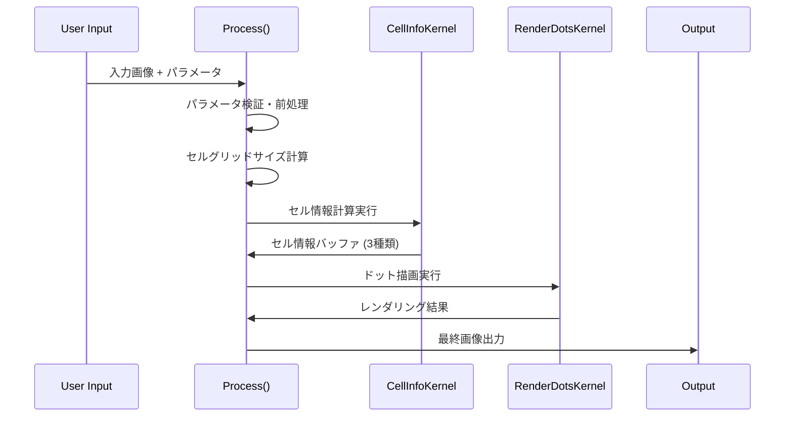
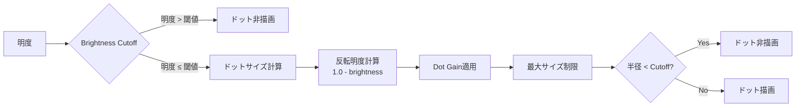

# MugSimpleHalftone.fuse 技術仕様書

## 概要

MugSimpleHalftone.fuse は、DaVinci Resolve/Fusion 用の高性能なハーフトーンエフェクトプラグインです。六角形グリッドベースのドット配置により、印刷物風のハーフトーン効果を生成します。GPU アクセラレーション（OpenCL）を使用し、リアルタイムでの高品質なレンダリングを実現します。

## アーキテクチャ概要


## メイン処理フロー

### 1. 全体処理フロー



### 2. セルグリッド計算

六角形配置のセルグリッドは以下の計算で決定されます：

```lua
-- セルピッチ計算
local SIN60 = 0.866025  -- √3/2
local cellBasePitch = floor(max(3.0, width / screenDensity))
local cellPitchX = cellBasePitch
local cellPitchY = floor(max(3.0, cellBasePitch * SIN60))

-- グリッドサイズ
local cellGridNumX = ceil(width / cellPitchX) + 3
local cellGridNumY = ceil(height / cellPitchY) + 2
```

## GPU カーネル詳細

### CellInfoKernel（セル情報計算）

このカーネルは各セルの基本情報を計算し、3 つの情報バッファに格納します。


#### セル情報バッファの構造

**cellInfo1 (位置情報)**

- `x`: セル IDX (グリッド座標 X)
- `y`: セル IDY (グリッド座標 Y)
- `z`: セル中心位置 X (ピクセル座標)
- `w`: セル中心位置 Y (ピクセル座標)

**cellInfo2 (ドット情報)**

- `x`: セル輝度値 (0.0-1.0)
- `y`: ドット半径 (ピクセル単位)
- `z`: 行オフセットフラグ (0=通常行, 1=オフセット行)
- `w`: 予約済み (将来拡張用)

**cellInfo3 (色情報)**

- `x`: 元の色 R 成分 (0.0-1.0)
- `y`: 元の色 G 成分 (0.0-1.0)
- `z`: 元の色 B 成分 (0.0-1.0)
- `w`: 元の色 A 成分 (透明度)

#### 六角形グリッド配置


#### 円形サンプリング最適化


### RenderDotsKernel（ドット描画）

各ピクセルが属するセルとその周辺セルを検索し、ドットの描画を行います。


#### 隣接セル検索パターン


## パラメータ詳細

### 基本パラメータ

| パラメータ        | デフォルト | 範囲     | 説明                         |
| ----------------- | ---------- | -------- | ---------------------------- |
| Screen Density    | 150.0      | 1-1000   | ハーフトーンパターンの密度   |
| Contrast          | 1.0        | 0.1-15.0 | コントラスト調整             |
| Dot Gain          | 0.0        | -1.0-1.0 | インクの滲み効果シミュレート |
| Brightness Cutoff | 0.75       | 0.0-1.0  | ドット描画しない明度閾値     |
| Cutoff Dot Radius | 0.05       | 0.0-1.0  | 描画しない最小ドット半径     |
| Clip Dot Radius   | 1.0        | 0.0-1.0  | ドットの最大サイズ制限       |

### 視覚効果パラメータ



### 色設定


## アンチエイリアシング

小さなドットの境界を滑らかに保つため、RenderDotsKernel では距離ベースのカバレッジ計算と段階的な減衰を組み合わせたアンチエイリアシングを行います。

### カバレッジ計算の流れ

- ドット半径 `dotRadius` に対して、`AA Edge Softness` パラメータから算出した実効エッジ幅 `aaEdgeWidth` を適用し、内側境界 `innerRadius = max(dotRadius - aaEdgeWidth, 0)` を定義します。
- ピクセルの距離二乗 `distSq` が `dotRadius^2` を超えればカバレッジは 0。`innerRadius^2` より小さければ 1。境界帯に入った場合は $\text{coverage} = \text{saturate}\Big(\dfrac{dotRadius - dist}{aaEdgeWidth}\Big)$ を用いた線形フェードで 0-1 の値を作ります。
- `aaEdgeWidth` が 0、またはドット半径が `DOT_RADIUS_THRESHOLD` 以下の場合はアンチエイリアスをスキップし、カバレッジはステップ関数として扱います。

```mermaid
graph LR
    A[ピクセル-ドット中心距離 dist] --> B{dist ≥ dotRadius?}
    B -->|Yes| C[coverage = 0.0]
    B -->|No| D{dist ≤ innerRadius?}
    D -->|Yes| E[coverage = 1.0]
    D -->|No| F[(dotRadius - dist) / aaEdgeWidth]
    F --> G[saturate]

    C --> H[blendDotOver]
    E --> H
    G --> H
```

### 重なり合うドットの優先判定

- 各ピクセルは所属セルに加えて最大 6（高密度時は 2）つの隣接セルからの候補ドットを評価します。
- `checkCellDot()` が返すカバレッジ（エッジ減衰後の 0-1 値）に、オリジナルカラー使用時は「暗い色ほど強い」となるよう $1-\text{luma}$ を掛け合わせ、`bestStrength` として保持します。
- `bestStrength` が大きい候補、同値の場合はカバレッジが大きい候補が選択され、`blendDotOver()` で紙色／入力画像の上に 1 枚のドットとしてブレンドされます（複数ドットの加算合成を避け、にじみや過剰な濃度を防止）。
- AA 処理はこの最終的に選ばれたドットに対してのみ適用されるため、隣接セルが重なっても境界のフェザリング幅は維持されます。

### 実装上の考慮

- バウンディングボックス（`dotRadius + margin + aaEdgeWidth`）で不必要な距離計算を除外し、AA のコストを局所化しています。
- ピクセルごとに平方根計算を遅延させ、`distSq` 比較で早期リターンすることで、アンチエイリアスを有効にしても GPU の負荷が過剰に増えないようにしています。
- `AA Edge Softness` はセルピッチの平均に基づいて物理的なピクセル幅へ変換されるため、スクリーン密度を変えてもアンチエイリアス幅の感覚が大きくズレない設計です。

### 視覚比較サマリー（GitHub プレビュー対応）

| 距離カテゴリ     | ピクセル距離の状態               | カバレッジ値 | ドットの見え方 | 説明                                                                                    |
| ---------------- | -------------------------------- | ------------ | -------------- | --------------------------------------------------------------------------------------- |
| 中心コア         | $dist \le innerRadius$           | 1.00         | `⬤`            | 完全に塗りつぶされた領域。ブレンド時もドット色がそのまま適用されます。                  |
| 滑らかなエッジ帯 | $innerRadius < dist < dotRadius$ | 0.01〜0.99   | `◐`            | 距離に応じた減衰でフェザー状に見える領域。AA Edge Softness が広いほど滑らかになります。 |
| 外側             | $dist \ge dotRadius$             | 0.00         | `○`            | カバレッジ 0 のため背景色のみが残ります。                                               |

### 候補セルの視覚フロー


上図の通り、重なり合う領域でも最終的に 1 つの候補ドットが選ばれ、アンチエイリアスはそのドットのみに適用されます。

## 最適化技術

### 1. GPU 並列処理最適化

- **バウンディングボックス**: ドット周辺のみを計算対象とする
- **早期リターン**: 計算不要なケースの高速スキップ
- **ベクトル演算**: SIMD 命令活用による高速化

### 2. メモリアクセス最適化


### 3. 動的品質調整

- **高密度モード**: 密度に応じて隣接セルチェック数を調整
- **サンプリング最適化**: 半径に応じてサンプリングステップを調整

## 使用例と Tips

### 基本的な使用方法

1. **新聞風効果**: Screen Density = 80-120, Use Original Color = Off
2. **雑誌風効果**: Screen Density = 150-200, Use Original Color = On
3. **アート効果**: Screen Density = 50-80, Dot Gain = 0.2-0.5

### パフォーマンス最適化

- 高解像度画像では Screen Density を下げる
- リアルタイム再生時は Enable Dot Antialias を無効にする
- Original Color 使用時は、コントラストを適切に調整する

## 技術的制約

- OpenCL 対応 GPU 必須
- 最大解像度: GPU VRAM に依存
- セルグリッド最大サイズ: 理論上無制限（実際はメモリ制約）

## 拡張可能性

現在の実装は将来的な機能拡張を考慮して設計されています：

- cellInfo2.w フィールド（予約済み）
- 追加のブレンドモード
- カスタムドット形状
- マルチレイヤー対応

---

_このドキュメントは MugSimpleHalftone.fuse v2.40 に基づいて作成されています。_
